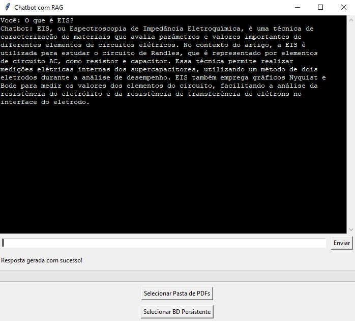

# RAG Chatbot com Artigos Científicos sobre Eficiência Energética

Este projeto implementa um chatbot baseado na técnica de **Retrieval-Augmented Generation (RAG)**, utilizando artigos científicos sobre eficiência energética como fonte de conhecimento. A aplicação combina recuperação de chunks relevantes com modelo de linguagem para responder a perguntas do usuário.

## Funcionalidades

- **Extração de Texto de PDFs**: Extrai texto de arquivos PDF de artigos científicos, com suporte a caracteres UTF-8 e fallback para evitar erros.
- **Divisão de Texto em Chunks**: Divide os textos em trechos menores para facilitar o processamento e a indexação.
- **Banco de Dados Vetorial Persistente**: Usa a biblioteca [ChromaDB](https://www.trychroma.com/) para indexar e recuperar embeddings de trechos relevantes.
- **Integração com OpenAI**: Utiliza o modelo `text-embedding-ada-002` para gerar embeddings e o `gpt-4o-mini` para responder às perguntas com base no contexto.
- **Interface Gráfica (Tkinter)**: Interface básica para carregar arquivos, configurar o banco de dados e interagir com o chatbot.

## Estrutura do Projeto

```plaintext
.
├── chatRAG.py       # Código principal do chatbot
├── .env             # Configurações de variáveis de ambiente (API Key da OpenAI)
└── README.md        # Documentação do projeto
```

## Pré-requisitos

Certifique-se de ter as seguintes dependências instaladas:

- Python 3.7 ou superior
- Bibliotecas Python:
  - `openai`
  - `chromadb`
  - `PyPDF2`
  - `numpy`
  - `tkinter`
  - `python-dotenv`

## Instalação

1. Clone este repositório:
   ```bash
   git clone https://github.com/PedroThiagoRoque/RAG-chatbot-Base
   cd chatRAG
   ```

2. Instale as dependências:
   ```bash
   pip install -r requirements.txt
   ```

3. Configure a variável de ambiente:
   - Crie um arquivo `.env` na raiz do projeto e insira sua chave da API OpenAI:
     ```
     OPENAI_API_KEY=your_openai_api_key_here
     ```

## Uso



1. Execute o script principal:
   ```bash
   python chatRAG.py
   ```

2. Na interface gráfica, configure o banco de dados vetorial selecionando uma pasta para criar ou carregar um banco de dados local persistente.

3. Escolha a pasta que contém os arquivos PDF com os artigos científicos a serem processados.

4. Insira perguntas relacionadas à eficiência energética no campo de entrada e receba respostas baseadas no conteúdo dos artigos carregados.

5. Adicione conteúdos individualmente em PDF com o botão 'Adicionar PDF'.

## Contribuição

Sinta-se à vontade para contribuir com melhorias, relatando problemas ou enviando pull requests.
